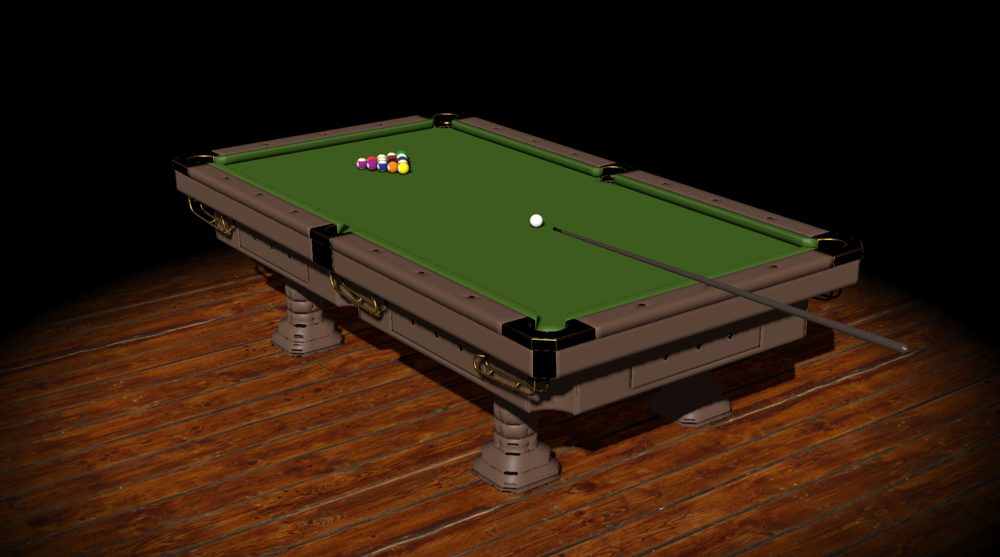

# PoolBall Project

This project simulates a pool table with realistic ball physics using Three.js for 3D rendering and Cannon.js for physics. The project includes functionalities for cue control, ball collisions, and ball-pocket interactions.

## Table of Contents

- [Demo](#demo)
- [Features](#features)
- [Installation](#installation)
- [Contributing](#contributing)
- [License](#license)

## Demo

A live demo of the project can be found [here](#).

## Features

- Realistic pool ball physics using Cannon.js
- 3D rendering with Three.js
- State management for different game modes
- GUI controls for angle and force adjustments

## Game Controls
- Angle Control: Use the A and D keys to adjust the angle of the cue.
- Force Control: Use the GUI slider to adjust the force of the shot.
- Shoot: Press the Space key to shoot the cue ball.
- Game Modes:
- Two Player Mode: Click the "Play" button on the start screen. (Under development)
- Sandbox Mode: Click the "Sandbox" button on the start screen.
- Reset White Ball: Press the Enter key to reset the position of the white ball.

## Contributing
Contributions are welcome. Please open an issue or submit a pull request for any improvements or bug fixes.

- Fork the repository.
- Create your feature branch: git checkout -b feature/YourFeature
- Commit your changes: git commit -m 'Add some feature'
- Push to the branch: git push origin feature/YourFeature
- Open a pull request.
